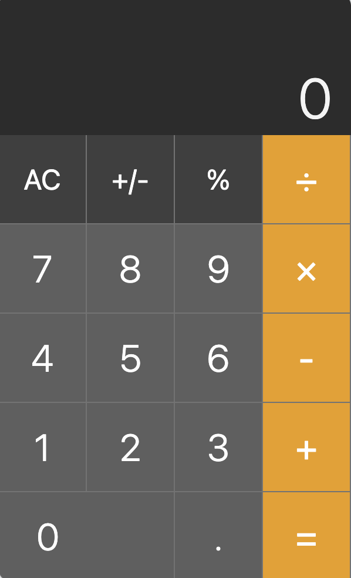

# CalCy - A Simple Calculator App 🔥

The UI is shamelessly inspired by the iOS calculator app. 📱

A sleek and user-friendly calculator app built with HTML, CSS, and JavaScript. This app is designed to handle basic arithmetic operations and some unique functionalities with an intuitive interface.

## Features

- Basic arithmetic operations: **Addition**, **Subtraction**, **Multiplication**, and **Division**.
- Support for **sign (+/-)** change and **percentage (%)** calculations.
- Keyboard support for all operations. ⌨️
- Adaptive display font-size.

## Live Demo
[Try it out 🚀](https://bishwarup307.github.io/odin-calc)

Your feedback/criticism is welcome 😊.

## How It Works

The application leverages a stack-based logic to process user inputs and calculate results dynamically:

1. **Input Buffering**: User inputs are held in a buffer until an operand key is pressed.
2. **Operand Key Press Handling**:
   - Upon pressing an operand key, it's pushed to the stack.
   - The stack is then evaluated to resolve the expression at the top.
3. **Stack Evaluation**:
   - Evaluation is based on the latest operand key pressed.
   - Operations consider up to the last three elements in the stack for calculation.
4. **Special Operand Keys**:
   - Keys like '+', '-', 'x', '/', and '=' trigger calculations on the stack.
   - Sign('+/-') and percent('%') keys perform immediate calculations on the last number without full stack evaluation.

### Stack Evaluation Logic

- Operations are performed based on the stack's current state, with four main scenarios considered for evaluation:
  1. Triple number sequence: The last number is returned as the new stack.
  2. Number-Number-Operand sequence: The second number is kept for further operations.
  3. Operand-Number-Number sequence: Ignores the first operand, focusing on the last number.
  4. Number-Operand-Number sequence: Performs the operation and updates the stack with the result.

🚀 The code is heavily commented for understanding and collaboration.

#### Background image by [Gerd Altmann from Pixabay](https://pixabay.com/illustrations/pay-digit-number-abundance-count-1036469/)
